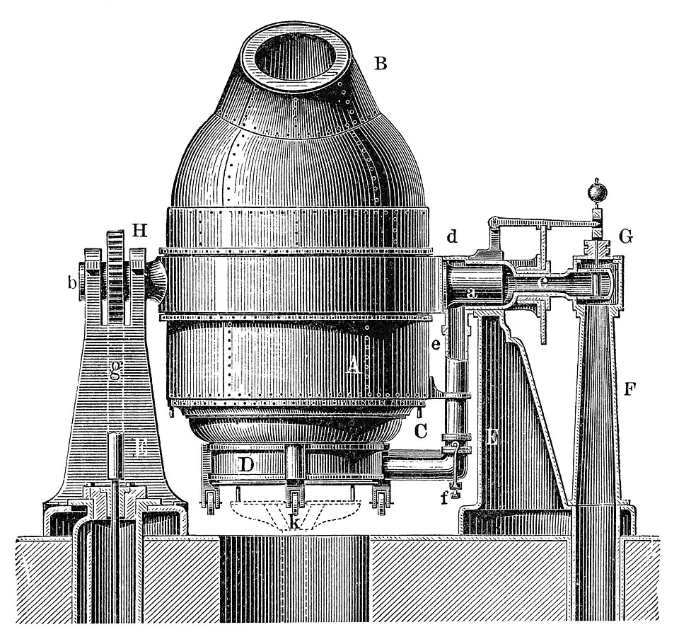
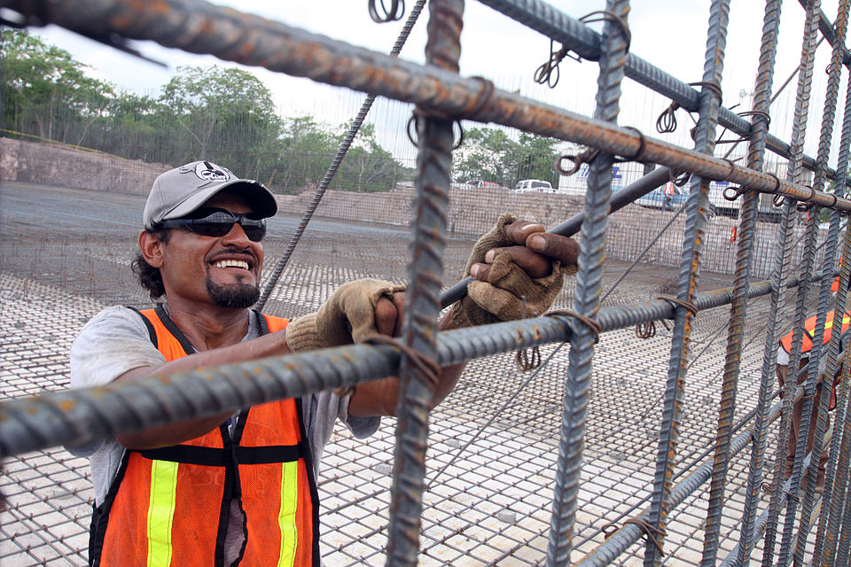
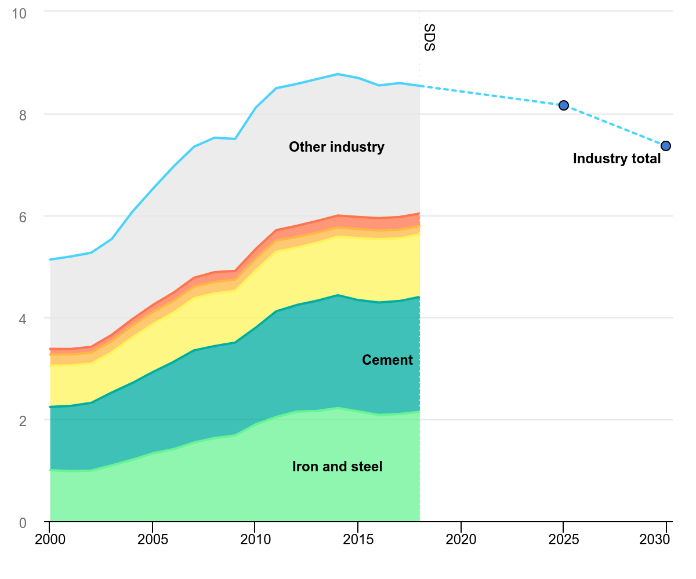

# Disclaimer

> - I am not a civil engineer
> - I am not a climate scientist
> - I'm just a weirdo with a passion for materials

# What is steel?

- Alloy of iron and carbon

- You can get all sorts of useful materials from this!

  {width=2in}

# We make a lot of it

- 1.866 Gt globally in 2024 (up from 0.885Gt in 2000)
- Roughly 231 kg per person [^1]
- More than global Aluminum (0.069Gt) + Copper (0.023Gt) [^2]

# Pop Quiz: Where is all the steel!?

Steel is in a lot of stuff, but where is most of it?

Is it in:

1.  Appliances? (washing machines, toasters, etc.)
2.  Mechanical Equipment? (tools, cranes, heavy machinery, etc.)
3.  Construction?
4.  Cars and other transportation?

# Answers: Where is all the steel!?

> 1.  Appliances? -\> 2%
> 2.  Mechanical Equipment? -\> 19%
> 3.  Construction? -\> 52%
> 4.  Cars and other transportation? -\> 17%

# Tanget 1: Rebar

- Since the mid 19th century, we've been reinforcing concrete with steel
  to make it better.[^3]
- Increased tensile strength
- Steel expands at a very similar rate to concrete.[^4]
- Now we can pour concrete into basically any shape and size

{width=2in}

# Tanget 1: Rebar (cont.)

- Mostly carbon steel
- Not just steel: fiberglass, stainless steel, even bamboo![^5]

# Construction

- We use steel in other parts of construction too:
  - framing
  - cables
  - railroad tracks

# The bad news

- Making steel takes a lot of energy (~20 GJ/ton) [^6]
- Steel/iron industry uses more energy and emits more carbon than any
  other industry

{width=3in} [^7]

# The good news

- Steel is **really** recyclable
- Around 60% of steel is recycled! (2009) [^8]
- Rebar is typically made with almost 100% recycled material.
- After demolition, between 60-70% of rebar is recycled (in the US) [^9]
- Typically, recycling uses electric arc furnaces (EAF) which don't burn
  fossil fuels.

# The worse news

- The energy intensity of steel production hasn't changed much in the
  past 20 years.
- There's not enough scrap to meet steel demand. The steel is currently
  in use! [^10]
- A green electic grid uses more steel than fossil fuels [^11]

# Conclusion: Can we Escape the Iron Age?

## High Tech

- decrease the energy intensity of the steel industry:
  - EAFs
  - hydrogen in BOFs
  - nuclear power! [^12]

## Low Tech

- decrease the demand for steel:
  - make cars lighter
  - alternate building materials (wood, composites, etc.)

[^1]: <https://web.archive.org/web/20250909165013/https://worldsteel.org/data/world-steel-in-figures/world-steel-in-figures-2024/>

[^2]: <https://nora.nerc.ac.uk/id/eprint/539285/>

[^3]: <https://books.google.com/books?id=DDJzDgAAQBAJ&pg=PA49>

[^4]: <https://web.archive.org/web/20120220142121/http://www.writing.eng.vt.edu/urs/wallenfelsz.pdf>

[^5]: <https://www.romanconcrete.com/docs/bamboo1966/BambooReinforcedConcreteFeb1966.htm>

[^6]: <https://www.pismin.com/10.1016/j.jenvman.2019.109782>

[^7]: <https://www.iea.org/data-and-statistics/charts/industry-direct-co2-emissions-in-the-sustainable-development-scenario-2000-2030>

[^8]: <https://web.archive.org/web/20080414215636/http://encarta.msn.com/encyclopedia_761556346/Recycling.html>

[^9]: <https://web.archive.org/web/20220127092845/https://www.crsi.org/index.cfm/architecture/recycling>

[^10]: <https://www.pismin.com/10.1016/j.jenvman.2019.109782>

[^11]: <https://doi.org/10.1016/j.resconrec.2020.105200>

[^12]: <https://doi.org/10.1016/j.resconrec.2020.105200>
